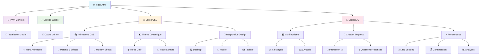
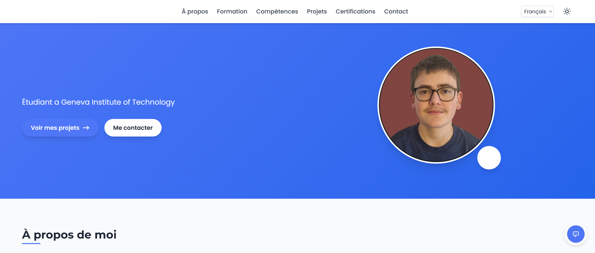

# 🚀 Portfolio Thomas Prudhomme

<div align="center">
  
  <h1>👋 Bienvenue sur mon Portfolio</h1>
  <p><em>Informaticien passionné • Développeur Full-Stack • Innovateur</em></p>

  <!-- Badges dynamiques -->
  <p>
    
    
    
    
  </p>

  <!-- Liens principaux -->
  <p>
    <a href="https://thomastp.me">
      
    </a>
    <a href="https://github.com/Thomas-TP/thomas-tp.github.io">
      
    </a>
  </p>

  <!-- Animation de frappe -->
  <p>
    
  </p>
</div>

---

## 📋 Table des Matières

- [✨ À Propos](#-à-propos)
- [🎯 Fonctionnalités Clés](#-fonctionnalités-clés)
- [🛠️ Technologies Utilisées](#️-technologies-utilisées)
- [🏗️ Architecture du Site](#️-architecture-du-site)
- [🎨 Design & Animations](#-design--animations)
- [📸 Captures d'Écran](#-captures-décran)
- [🚀 Démarrage Rapide](#-démarrage-rapide)
- [📊 Scripts Disponibles](#-scripts-disponibles)
- [🤝 Contribution](#-contribution)
- [📄 Licence](#-licence)
- [📞 Contact](#-contact)

---

## ✨ À Propos

Bienvenue sur mon portfolio personnel ! Je suis **Thomas Prudhomme**, un informaticien passionné spécialisé dans le développement web moderne. Ce site représente ma vitrine numérique où je partage mes compétences, projets et parcours professionnel.

### 🎯 Ma Philosophie
> *"L'innovation naît de la curiosité et l'excellence de la rigueur technique"*

Ce portfolio n'est pas qu'un simple CV numérique - c'est une expérience interactive qui reflète ma passion pour :
- 🌟 Les technologies web modernes
- 🎨 L'UX/UI design intuitif
- ⚡ Les performances optimisées
- 🔧 L'architecture logicielle propre

---

## 🎯 Fonctionnalités Clés

<div align="center">
  <table>
    <tr>
      <td align="center">
        <br/>
        <b>Responsive Design</b><br/>
        <small>Adapté à tous les écrans</small>
      </td>
      <td align="center">
        <br/>
        <b>PWA Compatible</b><br/>
        <small>Fonctionne hors-ligne</small>
      </td>
      <td align="center">
        <br/>
        <b>Multilingue</b><br/>
        <small>Français & Anglais</small>
      </td>
    </tr>
    <tr>
      <td align="center">
        <br/>
        <b>Thème Dynamique</b><br/>
        <small>Clair & Sombre</small>
      </td>
      <td align="center">
        <br/>
        <b>Chatbot IA</b><br/>
        <small>Botpress intégré</small>
      </td>
      <td align="center">
        <br/>
        <b>SEO Optimisé</b><br/>
        <small>Open Graph & Twitter Cards</small>
      </td>
    </tr>
  </table>
</div>

### 🚀 Capacités Techniques

- **📱 Progressive Web App (PWA)** : Installation sur mobile, cache intelligent, notifications
- **🌍 Internationalisation** : Sélecteur de langue fluide avec traduction complète
- **🌓 Mode Thème** : Basculement automatique entre thème clair/sombre
- **⚡ Performance** : Optimisation Lighthouse, compression d'assets, lazy loading
- **🤖 Intelligence Artificielle** : Chatbot conversationnel pour l'interaction utilisateur
- **🎨 Animations Modernes** : CSS3, JavaScript, effets visuels subtils
- **🔍 Accessibilité** : Conformité WCAG, navigation clavier, lecteurs d'écran

---

## 🛠️ Technologies Utilisées

### 🎨 Frontend
<div align="center">
  
  
  
  
</div>

### ⚙️ Backend & Outils
<div align="center">
  
  
  
  
</div>

### 📱 PWA & Performance
<div align="center">
  
  
  
</div>

---

## 🏗️ Architecture du Site



### 📂 Structure des Fichiers

```
thomas-tp.github.io/
├── 📄 index.html              # Page principale
├── 📱 manifest.json           # Configuration PWA
├── ⚡ service-worker.js       # Cache et offline
├── 🎨 styles.css             # Styles principaux
├── 🚀 script.js              # Logique JavaScript
├── 🤖 chatbot.js             # Intelligence artificielle
├── 📁 assets/                # Ressources statiques
│   ├── 🖼️ images/           # Images organisées
│   │   ├── 👤 profile.jpg    # Photo de profil
│   │   ├── 🏢 logos/         # Logos entreprises
│   │   ├── 🏆 certifications/ # Badges certifs
│   │   ├── 💼 projects/      # Images projets
│   │   ├── 🎯 favicon/       # Icône du site
│   │   └── 📱 icons/         # Icônes PWA
│   └── 📄 cv/               # Documents CV
├── 🎨 css/                  # Feuilles de style
│   ├── ✨ animations.css     # Animations CSS
│   ├── 🎪 m3-animations.css  # Material 3
│   ├── 🎨 styles.css         # Styles principaux
│   └── 🌓 dark-theme.css     # Thème sombre
├── 🚀 js/                   # Scripts JavaScript
│   ├── ⚡ hero-animation.js  # Animation hero
│   └── 🎯 script.js         # Logique principale
├── 🛠️ tools/               # Outils développement
│   ├── 🔗 check-links.py    # Vérification liens
│   └── 🧹 clean.py          # Nettoyage fichiers
├── 📋 README.md            # Cette documentation
├── 📄 CNAME                # Domaine GitHub Pages
└── 📦 package.json         # Configuration npm
```

---

## 🎨 Design & Animations

### 🎭 Philosophie Design

Mon approche du design web combine **esthétique moderne** et **fonctionnalité optimale** :

- **🎨 Material Design 3** : Composants modernes et cohérents
- **🌈 Palette de Couleurs** : Dégradés subtils et contrastes accessibles
- **📐 Typographie** : Polices Google Fonts (Poppins & Montserrat)
- **✨ Micro-Interactions** : Animations fluides et significatives
- **🎯 UX Intuitive** : Navigation claire et prévisible

### 🚀 Animations Features

<div align="center">
  <table>
    <tr>
      <td align="center">
        <br/>
        <b>Hero Animation</b><br/>
        <small>Animation d'accueil dynamique</small>
      </td>
      <td align="center">
        
        <br/>
        <b>Transitions Fluides</b><br/>
        <small>Hover & focus effects</small>
      </td>
      <td align="center">
        
        <br/>
        <b>Scroll Animations</b><br/>
        <small>Reveal on scroll</small>
      </td>
    </tr>
  </table>
</div>

### 🎪 Effets Visuels

- **🌟 Particle Effects** : Animations de particules subtiles
- **💫 Loading Animations** : Indicateurs de chargement élégants
- **🎨 Color Transitions** : Changements de thème fluides
- **📱 Mobile Gestures** : Animations tactiles optimisées
- **⚡ Performance** : Animations GPU-accélérées

---

## 📸 Captures d'Écran

<div align="center">
  <table>
    <tr>
      <td align="center">
        <br/>
        <b>🏠 Page d'accueil</b><br/>
        <small>Design moderne et responsive</small>
      </td>
      <td align="center">
        <br/>
        <b>👤 Profil</b><br/>
        <small>Présentation personnelle</small>
      </td>
    </tr>
    <tr>
      <td align="center">
        <br/>
        <b>🎓 Formation</b><br/>
        <small>École Polytechnique Fédérale</small>
      </td>
      <td align="center">
        <br/>
        <b>🏆 Certifications</b><br/>
        <small>Compétences validées</small>
      </td>
    </tr>
  </table>
</div>

### 📱 Responsive Design

Le site s'adapte parfaitement à tous les appareils :

- **💻 Desktop** : Layout complet avec toutes les fonctionnalités
- **📱 Mobile** : Interface optimisée pour le tactile
- **📟 Tablette** : Design hybride adaptatif

---

## 🚀 Démarrage Rapide

### 🌐 Accès en Ligne
Visitez le site directement : **[thomastp.me](https://thomastp.me)**

### 🖥️ Installation Locale

```bash
# 1. Cloner le repository
git clone https://github.com/Thomas-TP/thomas-tp.github.io.git
cd thomas-tp.github.io

# 2. Installer les dépendances
npm install

# 3. Lancer le serveur de développement
npm run dev
# ou
python -m http.server 8000

# 4. Ouvrir dans le navigateur
# http://localhost:8000
```

### 📱 Installation PWA
1. Ouvrez le site dans Chrome/Safari
2. Cliquez sur "Ajouter à l'écran d'accueil"
3. Le site fonctionne maintenant hors-ligne !

---

## 📊 Scripts Disponibles

<div align="center">

| Commande | Description | Usage |
|----------|-------------|-------|
| `npm run dev` | 🚀 Lance le serveur de développement | Développement local |
| `npm run build` | 📦 Build optimisé (statique) | Pas nécessaire pour ce projet |
| `npm run lighthouse` | 📊 Audit de performance | Analyse SEO & perf |
| `npm run check-links` | 🔗 Vérification des liens | Validation des références |
| `npm run clean` | 🧹 Nettoyage des fichiers temporaires | Maintenance |

</div>

### 🔧 Outils de Développement

- **⚡ Lighthouse** : Audit de performance et accessibilité
- **🔍 WebPageTest** : Tests de vitesse et optimisation
- **🎯 WAVE** : Évaluation de l'accessibilité
- **📱 Chrome DevTools** : Debugging et optimisation

---

## 🤝 Contribution

Les contributions sont les bienvenues ! 🎉

### 📝 Comment Contribuer

1. **🍴 Fork** le projet
2. **🌿 Créer** une branche feature (`git checkout -b feature/AmazingFeature`)
3. **💾 Commit** vos changements (`git commit -m 'Add some AmazingFeature'`)
4. **🚀 Push** vers la branche (`git push origin feature/AmazingFeature`)
5. **🔄 Ouvrir** une Pull Request

### 🐛 Signaler un Bug

Utilisez le [système d'issues GitHub](https://github.com/Thomas-TP/thomas-tp.github.io/issues) pour :
- 🐛 Reporter des bugs
- 💡 Proposer des fonctionnalités
- ❓ Poser des questions

### 📋 Standards de Code

- **🎨 HTML/CSS** : Respect des conventions BEM
- **🚀 JavaScript** : ES6+, commentaires JSDoc
- **📱 Responsive** : Mobile-first approach
- **♿ Accessibilité** : Conformité WCAG 2.1

---

## 📄 Licence

Distribué sous licence **MIT**. Voir `LICENSE` pour plus d'informations.

[](https://opensource.org/licenses/MIT)

---

## 📞 Contact

<div align="center">

**Thomas Prudhomme** 👨‍💻

[](https://thomastp.me)
[](https://linkedin.com/in/thomas-prudhomme)
[](https://github.com/Thomas-TP)
[](mailto:contact@thomastp.me)

---

### 💬 Discutons !

N'hésitez pas à me contacter pour :
- 💼 Opportunités professionnelles
- 🤝 Collaborations
- 💡 Échange d'idées techniques
- ❓ Questions sur mes projets

---

<div align="center">
  <p><strong>Fait avec ❤️ par Thomas Prudhomme</strong></p>
  <p>
    
    
    
    
  </p>
</div>

---

⭐ **N'oubliez pas de mettre une étoile si ce projet vous plaît !**

</div>