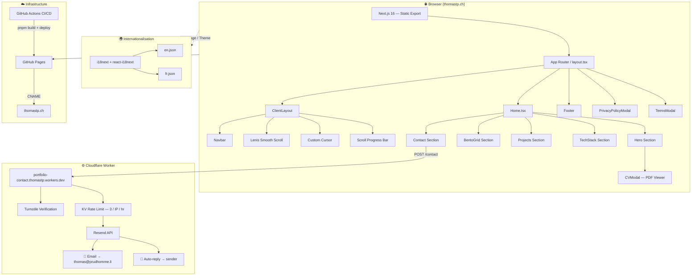

<div align="center">

  <picture>
    <source media="(prefers-color-scheme: dark)" srcset="public/icons/favicon.svg">
    <source media="(prefers-color-scheme: light)" srcset="public/icons/favicon-light.svg">
    
  </picture>

  # Thomas P. — Portfolio

  <p align="center">
    <b>Student at Geneva Institute of Technology</b><br />
    <i>Crafting digital experiences with precision and minimalism.</i>
  </p>

  <br />

  [](https://nextjs.org/)
  [](https://reactjs.org/)
  [](https://www.typescriptlang.org/)
  [](https://tailwindcss.com/)
  [](https://www.framer.com/motion/)
  [](https://workers.cloudflare.com/)

  <br />
  <br />

  <a href="https://thomastp.ch/">
    
  </a>

</div>

<br />

---

## ⚡ Overview

A modern portfolio built with **Next.js 16** (static export), **React 19**, and **TypeScript 6**. The design follows a strict **monochrome aesthetic** — adapting seamlessly between light and dark modes. It features a Bento Grid layout, scroll-driven animations, multilingual support (EN/FR), and a functional contact form backed by a Cloudflare Worker with Turnstile CAPTCHA and rate limiting.

> **"Simplicity is the ultimate sophistication."**

<br />

---

## 💎 Key Features

| Feature | Description |
| :--- | :--- |
| **🌓 Theme System** | Adaptive Light / Dark with semantic tokens and smooth transitions |
| **🍱 Bento Grid** | Responsive modern grid showcasing skills, projects, and IoT work |
| **✨ Scroll Animations** | `Framer Motion` `whileInView` triggers on hero, projects, and tech stack |
| **🌍 i18n** | Full EN / FR support via `react-i18next` with browser language detection |
| **📬 Contact Form** | Cloudflare Worker + Resend API, CAPTCHA, rate limiting, email auto-reply |
| **🛡️ Turnstile CAPTCHA** | Seamless Cloudflare Turnstile (interaction-only, grayscale styled) |
| **🚦 Rate Limiting** | KV-backed: max 3 messages / IP / hour |
| **🔊 UX Feedback** | Web Audio API chime + haptic vibration on successful form submission |
| **🖱️ Custom Cursor** | Animated custom cursor (desktop only) |
| **📄 CV Modal** | Inline PDF viewer with download button |
| **🔒 Legal Modals** | Privacy Policy and Terms of Service modals |
| **📱 Fully Responsive** | Mobile-first, tested from 375 px to ultra-wide |

<br />

---

## 🏗️ Architecture Diagram



<br />

---

## 📂 Project Structure

```
Thomas-TP.github.io/
├── public/
│   ├── CNAME                       # Custom domain (GitHub Pages)
│   ├── robots.txt                  # SEO crawl rules
│   ├── sitemap.xml                 # SEO sitemap
│   ├── icons/
│   │   ├── favicon.svg             # Dark mode favicon
│   │   └── favicon-light.svg      # Light mode favicon
│   ├── images/
│   │   ├── memoji-nobg.webp        # Hero avatar
│   │   ├── og-image.png            # Open Graph / social preview
│   │   ├── noise.svg               # Background texture
│   │   └── linktree.png            # Linktree preview
│   └── documents/
│       └── ThomasPrudhommeCV.pdf   # Downloadable CV
│
├── src/
│   ├── app/
│   │   ├── layout.tsx              # Root layout + OG metadata
│   │   ├── page.tsx                # Home page
│   │   ├── not-found.tsx           # 404 page
│   │   ├── providers.tsx           # Theme + i18n providers
│   │   └── globals.css             # Global styles & Tailwind directives
│   ├── components/
│   │   ├── layout/
│   │   │   ├── ClientLayout.tsx    # Lenis scroll + noise bg wrapper
│   │   │   ├── Navbar.tsx          # Top navigation bar
│   │   │   └── Footer.tsx          # Footer with legal links
│   │   ├── sections/
│   │   │   ├── Hero.tsx            # Landing hero + CV button
│   │   │   ├── BentoGrid.tsx       # Skills / about bento cards
│   │   │   ├── Projects.tsx        # Project showcase
│   │   │   ├── TechStack.tsx       # Technology grid
│   │   │   └── Contact.tsx         # Contact form + social links
│   │   ├── modals/
│   │   │   ├── CVModal.tsx         # PDF CV viewer
│   │   │   ├── PrivacyPolicyModal.tsx
│   │   │   └── TermsModal.tsx
│   │   ├── ui/
│   │   │   ├── theme-provider.tsx  # Dark/light favicon swap
│   │   │   ├── mode-toggle.tsx     # Theme toggle button
│   │   │   ├── language-toggle.tsx # EN / FR toggle
│   │   │   ├── custom-cursor.tsx   # Animated cursor
│   │   │   ├── scroll-progress.tsx # Top scroll indicator
│   │   │   └── glitch-text.tsx     # Glitch animation component
│   │   ├── Home.tsx                # Page composition
│   │   └── NotFound.tsx            # 404 component
│   ├── locales/
│   │   ├── en.json                 # English translations
│   │   └── fr.json                 # French translations
│   ├── lib/utils.ts                # cn() helper (clsx + tailwind-merge)
│   └── i18n.ts                     # i18next configuration
│
├── cloudflare-worker/
│   ├── worker.ts                   # Contact form handler
│   └── wrangler.toml               # Worker config + KV binding
│
├── next.config.ts                  # Static export config
├── tsconfig.json
└── package.json
```

<br />

---

## 🛠️ Technology Stack

| Layer | Technology | Version |
| :--- | :--- | :--- |
| **Framework** | Next.js (App Router, static export) | 16.1.6 |
| **UI Library** | React | 19.2.4 |
| **Language** | TypeScript | 6 (beta) |
| **Styling** | Tailwind CSS | 4.2.1 |
| **Animations** | Framer Motion | 12.x |
| **Scroll** | Lenis | 1.3.x |
| **Icons** | Lucide React + React Icons | latest |
| **i18n** | i18next + react-i18next | 25.x |
| **PDF Viewer** | react-pdf | 10.x |
| **CAPTCHA** | Cloudflare Turnstile | seamless |
| **Email API** | Resend | REST |
| **Edge Worker** | Cloudflare Workers | — |
| **KV Store** | Cloudflare KV (rate limiting) | — |
| **Package Manager** | pnpm | 10.x |
| **CI/CD** | GitHub Actions | — |
| **Hosting** | GitHub Pages | — |

<br />

---

## 🚀 Getting Started

### Prerequisites

- **Node.js** ≥ 20
- **pnpm** ≥ 10 — `npm i -g pnpm`

### Installation

```bash
git clone https://github.com/Thomas-TP/Thomas-TP.github.io.git
cd Thomas-TP.github.io
pnpm install
```

### Development

```bash
pnpm dev
# → http://localhost:3000
```

### Production Build

```bash
pnpm build
# → ./out  (static export ready for GitHub Pages)
```

<br />

---

## 📬 Contact Form — Cloudflare Worker

The contact form is handled by a **Cloudflare Worker** deployed at `portfolio-contact.thomastp.workers.dev`.

### Flow

```
Browser → POST /contact
  → Turnstile token verification
  → KV rate limit check (3 messages / IP / hour)
  → Resend API → email to thomas@prudhomme.li
  → Resend API → auto-reply to sender
```

### Setup

```bash
cd cloudflare-worker
pnpm install
wrangler secret put RESEND_API_KEY
wrangler secret put TURNSTILE_SECRET_KEY
wrangler deploy
```

**`wrangler.toml`** (KV binding):

```toml
name = "portfolio-contact"
main = "worker.ts"
compatibility_date = "2024-01-01"

[[kv_namespaces]]
binding = "RATE_LIMIT"
id = "<your-kv-namespace-id>"
```

<br />

---

## 🌓 Theme — Light & Dark Mode

<picture>
  <source media="(prefers-color-scheme: dark)" srcset="https://img.shields.io/badge/You're_viewing-Dark_Mode-000000?style=for-the-badge&logo=moonrepo&logoColor=white">
  <source media="(prefers-color-scheme: light)" srcset="https://img.shields.io/badge/You're_viewing-Light_Mode-ffffff?style=for-the-badge&logo=sun&logoColor=black&labelColor=cccccc&color=f0f0f0">
  
</picture>

| | Dark Mode | Light Mode |
| :--- | :--- | :--- |
| **Background** | `#0a0a0a` | `#ffffff` |
| **Text** | `#fafafa` | `#0a0a0a` |
| **Accent** | `#ffffff` | `#000000` |
| **Favicon** | `favicon.svg` (white) | `favicon-light.svg` (black) |
| **Feel** | Premium / Cyberpunk | Minimalist / Swiss |

The favicon swaps automatically based on the OS color scheme via `theme-provider.tsx`.

<br />

---

## 🛡️ License

Distributed under the **MIT License**. See [LICENSE](LICENSE) for more information.

<br />

---

<div align="center">

  <picture>
    <source media="(prefers-color-scheme: dark)" srcset="public/icons/favicon.svg">
    <source media="(prefers-color-scheme: light)" srcset="public/icons/favicon-light.svg">
    
  </picture>

  <p>
    Made with ❤️ by <a href="https://github.com/Thomas-TP"><b>Thomas P.</b></a> &nbsp;·&nbsp;
    <a href="https://thomastp.ch">thomastp.ch</a>
  </p>

</div>

  <a href="https://github.com/Thomas-TP">
    
  </a>
</div>
